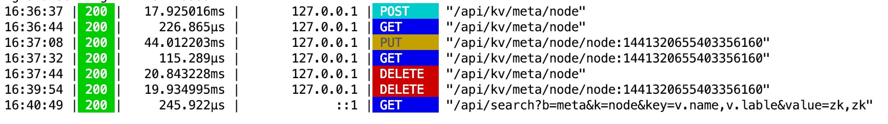
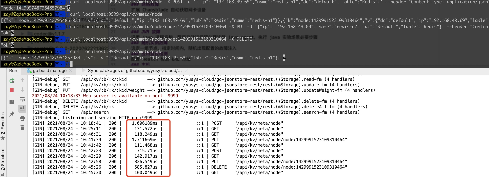

# Go-Jsonstore-Rest

A quick and easy way to setup a RESTful JSON DATASTORE server for small projects.

## Quick Start

Binary Download

https://github.com/yusys-cloud/go-jsonstore-rest/releases 

Startup

``` 
./go-jsonstore-rest
```

Replace ./json-db with the path to the drive or directory in which you want to store data.

```
./go-jsonstore-rest --path=./json-db --port=9999 
```
## Installation
``` 
go get github.com/yusys-cloud/go-jsonstore-rest
```
## Usage

### Base Codes
```
import (
	"github.com/gin-gonic/gin"
	"github.com/yusys-cloud/go-jsonstore-rest/rest"
	"net/http"
)
func main() {
	r := gin.Default()
	//REST-APIs-json
	rest.NewJsonStoreRest("./api-data", r)
	r.Run(":9991")
}
```

## RESTful API
- key:value store/cache
``` 
curl localhost:9999/api/cache -X POST -d '{"k":"k1","v":"hellow world"}'
```
``` 
curl localhost:9999/api/cache/k1
```
- First In, First Out (FIFO)
``` 
curl 'localhost:9999/api/fifo?size=10' -X POST -d '{"k":"key1","v":"hellow world"}'
```
``` 
curl localhost:9999/api/kv/meta/key1
```
- RESTful JSON DATASTORE

Create
``` 
curl localhost:9999/api/kv/meta/node -X POST -d '{"ip": "192.168.x.x","name":"redis-n1","idc":"default","lable":"Redis"}' --header "Content-Type: application/json"
```
Read
```
curl localhost:9999/api/kv/meta/node
```
Update
```
curl localhost:9999/api/kv/meta/node/node:1429991523109310464 -X PUT -d '{"ip": "192.168.49.69","name":"redis-n2","idc":"default","lable":"Redis"}' --header "Content-Type: application/json"
```
Delete
```
curl localhost:9999/api/kv/meta/node/node:1429991523109310464 -X DELETE
```
Delete All
```
curl localhost:9999/api/kv/meta/node -X DELETE
```
Search
```
curl http://localhost:9999/api/search?b=meta&k=node&key=v.name&value=linux&shortBy=weight,desc&page=1&size=10
```
/api/kv/:b/:k 
- 参数 b 为存储的json文件名，类似数据库名称
- 参数 k 为存储文件中json对象数组名，类似数据库中表名称

/api/search?b=node&k=node&key=v.name&value=linux&shortBy=v.weight,desc&page=1&size=2

/api/search?b=meta&k=node&key=v.name,v.lable&value=zk|zk2,zk&relation=like

- 参数 key 为搜索json对象中字段名称
- 参数 value 为搜索json对象字段的搜索值
- 参数 key 为json对象的搜索字段名称,需多层json key的完整路径值，如：v.name
- 参数 relation 为查询关系，默认为equal精准查询，可选like模糊查询
- 参数 value 为json对象字段的搜索值

``` 
[GIN-debug] POST   /api/kv/:b/:k             --> github.com/yusys-cloud/go-jsonstore-rest/rest.(*Storage).create-fm (3 handlers)
[GIN-debug] GET    /api/kv/:b/:k             --> github.com/yusys-cloud/go-jsonstore-rest/rest.(*Storage).readAll-fm (3 handlers)
[GIN-debug] GET    /api/kv/:b/:k/:kid        --> github.com/yusys-cloud/go-jsonstore-rest/rest.(*Storage).read-fm (3 handlers)
[GIN-debug] PUT    /api/kv/:b/:k/:kid        --> github.com/yusys-cloud/go-jsonstore-rest/rest.(*Storage).update-fm (3 handlers)
[GIN-debug] PUT    /api/kv/:b/:k/:kid/weight --> github.com/yusys-cloud/go-jsonstore-rest/rest.(*Storage).updateWeight-fm (3 handlers)
[GIN-debug] DELETE /api/kv/:b/:k/:kid        --> github.com/yusys-cloud/go-jsonstore-rest/rest.(*Storage).delete-fm (3 handlers)
[GIN-debug] DELETE /api/kv/:b/:k             --> github.com/yusys-cloud/go-jsonstore-rest/rest.(*Storage).deleteAll-fm (3 handlers)
[GIN-debug] GET    /api/search               --> github.com/yusys-cloud/go-jsonstore-rest/rest.(*Storage).search-fm (3 handlers)

```



## Benchmarks
- BenchmarkQuery100-12    	       1	2,102,479,566 ns/op
- BenchmarkCreate100-12    	       1	1082093859 ns/op
